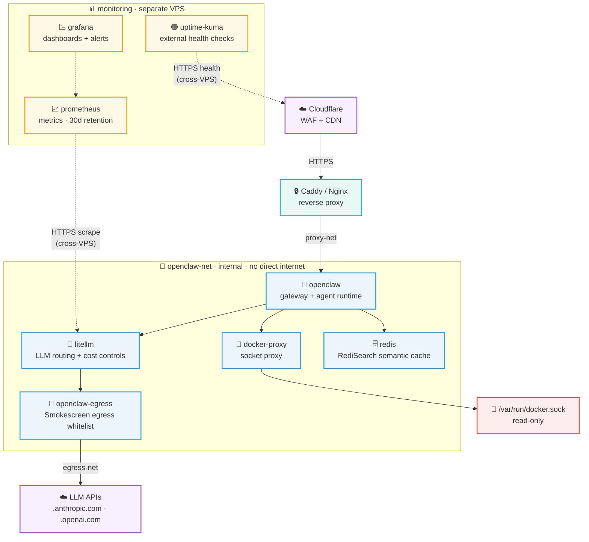

# OpenClaw Single-Server — AI Assistant Guide

## Context Management

Use subagents (Agent tool) to protect main context from verbose operations.

**Spawn agents for:** codebase exploration (3+ files), research/web searches, code review, any task where only the summary matters.
**Stay in main context for:** direct file edits, short targeted reads (1-2 files), back-and-forth conversation.

Rule: >3 files read or output the user doesn't need verbatim → delegate, return summary.

## Project Overview

**Documentation-only repository** — no app source, no build system, no automated tests. All content lives in Markdown files.

- **Artifact**: Production-grade, security-hardened OpenClaw deployment on Ubuntu 24.04 + Docker Compose
- **Target**: 1 KVM VPS (16 vCPU, 64 GB RAM, 8 GB swap, 4 TB NVMe)
- **OpenClaw Version**: `ghcr.io/openclaw/openclaw:2026.3.7` (pinned)
- **Threat model**: Prompt injection → arbitrary tool execution → host/container escape

## Repository Structure

```
clincher/
├── CLAUDE.md                    # This file
├── README.md                    # Primary artifact: 14-step deployment guide + Ansible docs
├── USECASES.md                  # Community use cases
├── LINKS.md                     # Curated links to skills, use cases, community resources
├── PROMPT_IMPROVEMENTS.md       # Audit of prompts/skills against skills-best-practices
├── prompts/                     # Agent-agnostic reusable prompts (.prompt.md files)
│   ├── README.md
│   ├── humanizer.prompt.md
│   ├── ansible-review.prompt.md
│   ├── github-deployment-guide.prompt.md
│   └── github-smallproject-virality.prompt.md
├── .claude/commands/            # Claude Code slash commands (skill wrappers)
├── ansible.cfg / requirements.yml / playbook.yml / inventory/hosts.yml
├── group_vars/all/{vars.yml, vault.yml.example}
└── roles/
    ├── base/                    # Steps 1-2: SSH, Docker, sysctl, UFW, fail2ban
    ├── openclaw-config/         # Step 3: Smokescreen, LiteLLM, Compose templates
    ├── openclaw-deploy/         # Step 4: docker compose up, health wait
    ├── openclaw-harden/         # Step 5: gateway/sandbox hardening
    ├── agency-agents/           # Step 5.1: prompt library (optional)
    ├── openclaw-integrate/      # Steps 6-8: API, Telegram, memory
    ├── reverse-proxy/           # Step 9: Caddy/Tunnel/Tailscale
    ├── verify/                  # Step 10: post-deploy verification
    └── maintenance/             # Steps 11+13: backups, watchdog, cron
```

Smokescreen egress proxy built from source via multi-stage Dockerfile. Docker Compose specs and scripts are embedded in `README.md`. Ansible files provide Jinja2-templated equivalents for automated deployment.

## Architecture

### Deployment Topology



Three bridge networks enforce least-privilege. `openclaw-net` is `internal: true` — no direct internet. Egress proxy bridges internal/external for whitelisted LLM calls only. Monitoring services (Prometheus, Grafana, Uptime Kuma) run on a separate VPS and scrape the OpenClaw host remotely over HTTPS.

### Services

| Service | Image | Purpose | Network |
|---------|-------|---------|---------|
| `docker-proxy` | `ghcr.io/tecnativa/docker-socket-proxy:v0.4.2` | Sandboxed Docker API (EXEC only) | `openclaw-net` |
| `openclaw` | `ghcr.io/openclaw/openclaw:2026.3.7` | Main gateway — agent runtime, tool execution | `openclaw-net` + `proxy-net` |
| `litellm` | `ghcr.io/berriai/litellm:main-v1.81.3-stable` | LLM API proxy — routing, cost controls, caching | `openclaw-net` |
| `openclaw-egress` | Built from [stripe/smokescreen](https://github.com/stripe/smokescreen) | Egress whitelist proxy for LLM API calls | `openclaw-net` + `egress-net` |
| `redis` | `redis/redis-stack-server:7.4.0-v3` | Semantic cache (RediSearch module) | `openclaw-net` |

Monitoring services (Prometheus, Grafana, Uptime Kuma) run on a **separate VPS** — deploy via `ansible-playbook caprover-playbook.yml`.

### Networks

- **`openclaw-net`**: Internal bridge — no internet access. Core services live here.
- **`egress-net`**: Bridges egress proxy to internet for whitelisted LLM API calls.
- **`proxy-net`**: Connects reverse proxy to the OpenClaw gateway.

### Security Model

1. **Network isolation**: `openclaw-net` is `internal: true`
2. **Egress control**: Smokescreen whitelists only HTTPS to LLM provider domains
3. **Socket proxy**: EXEC, CONTAINERS, IMAGES, INFO, VERSION, PING, EVENTS only — BUILD, SECRETS, SWARM denied
4. **Container hardening**: `cap_drop: ["ALL"]`, `no-new-privileges` at daemon + container level
5. **Sandbox hardening**: `capDrop=["ALL"]`, `network=none`, no workspace access
6. **Tool denials**: 13 dangerous tools blocked at agent and gateway levels
7. **Credential handling**: File-based secret passing — never CLI args
8. **SSH hardening**: Non-standard port, key-only auth, deploy user only, no forwarding
9. **Firewall**: UFW + fail2ban, admin IP whitelist, Cloudflare-only ingress

## README Structure

Preserve this 14-step order — never reorder or merge steps:

1. **Prerequisites** — Docker, system tuning, daemon config
2. **Configure Firewall** — UFW, Cloudflare ingress
3. **Create Configuration Files** — Smokescreen ACL, Docker Compose file
4. **Deploy** — `docker compose up -d`, verify egress
5. **Gateway and Sandbox Hardening** — Auth, sandbox isolation, tool denials, SOUL.md
6. **API Keys and Model Configuration** — LLM provider keys, default model
7. **Channel Integration** — Telegram (primary); Discord, WhatsApp, Signal supported
8. **Memory and RAG Configuration** — Voyage AI embeddings, QMD indexing
9. **Reverse Proxy Setup** — Caddy (recommended) or Cloudflare Tunnel
10. **Verification** — Security audit, health checks, connectivity tests
11. **Maintenance** — Backup scripts, token rotation, cron
12. **Troubleshooting** — Symptom/diagnostic/fix table
13. **High Availability and Disaster Recovery** — HA foundations, watchdog, unattended updates, backups, DR drills
14. **Scaling** — Vertical scaling, LiteLLM proxy, channel partitioning

**Order matters**: Hardening (Step 5) must precede reverse proxy exposure (Step 9). `depends_on` health conditions in the Compose file handle service start order automatically.

## Development Workflow

- **Branches**: `main` (remote) / `master` (legacy local) — trunk. Feature branches via PRs.
- **Change types**: security fixes, integration fixes, README restructuring, prompt additions, CLAUDE.md updates
- **Commit style**: `Fix 7 integration issues: network config, egress ACLs, directory ordering`

**Editing conventions:**
- Preserve 14-step structure
- Placeholders: `<SERVER_IP>`, `<SUBNET_CIDR>`, `<ADMIN_IP>`
- Never hardcode real IPs, passwords, or API keys
- Shell scripts: `set -euo pipefail`, `flock` for mutual exclusion, file-based secrets (not CLI args)

## Verification Commands

```bash
docker exec $(docker ps -q -f "name=openclaw") openclaw security audit --deep
docker exec $(docker ps -q -f "name=openclaw") openclaw sandbox explain
docker compose ps
docker exec $(docker ps -q -f "name=openclaw") \
  curl -x http://openclaw-egress:4750 -I https://api.anthropic.com
curl -I https://openclaw.yourdomain.com
```

## Common Pitfalls

1. **Secrets via CLI args**: `docker exec` args appear in process tables — always use file-based passing
2. **`openclaw-net` not internal**: Without `internal: true`, containers bypass the egress proxy
3. **Missing `depends_on` health conditions**: OpenClaw fails to connect if socket/egress proxy isn't healthy first
4. **Egress whitelist too broad**: Each whitelisted domain is a potential exfiltration channel

---

## Skill & Prompt Authoring

Source: [mgechev/skills-best-practices](https://github.com/mgechev/skills-best-practices). Applies to `prompts/*.prompt.md` and `.claude/commands/*.md`.

**Structure** (flat, one level deep):

```
skill-name/
├── SKILL.md        # <500 lines — metadata + core instructions
├── scripts/        # deterministic CLI tools (stdout/stderr for success/failure)
├── references/     # supplementary context, loaded just-in-time
└── assets/         # templates and static files
```

**Frontmatter:**
- `name`: 1–64 chars, kebab-case, matches directory name for skills; `.prompt.md` extension for standalone prompts
- `description`: ≤1,024 chars, third-person, include negative triggers to prevent false matches

**Progressive disclosure:**
- Main file <500 lines — offload bulk to `references/` or `assets/`
- Flat subdirs only (no `references/db/v1/schema.md` — use `references/schema.md`)
- Just-in-time: instruct agent to read a reference file only when that context is needed
- No `README.md`, `CHANGELOG.md`, or other cruft inside skill directories

**Writing instructions:**
- Numbered sequences with explicit decision branches
- Third-person imperative: "Extract the text…" not "You should extract…"
- Concrete templates in `assets/` rather than prose descriptions
- One term per concept — pick it and use it everywhere

**Validation dimensions:** discovery (frontmatter triggers correctly), logic (no forced guesses), edge cases (failure states, missing fallbacks), architecture (progressive disclosure enforced).

---

## Style Guide

**Core**
- Priority: accuracy > user goals > efficiency > style
- Default to action; ask one focused question when intent is unclear
- "I don't know" is correct when uncertain — never invent
- On correction: acknowledge once, fix, continue — no self-flagellation
- Flag security vulnerabilities immediately; never implement insecure patterns

**Voice and Tone**
- No minimizing language: "straightforward," "just," "simply," "easy"
- No sycophantic filler — lead with the answer
- Give opinions; don't fence-sit or ask permission to be useful
- Creative mode: commit to a choice, let the user redirect

**Teaching** (triggered by "why," "how," or explanation requests)
- Progression: intuition → example → mechanics; show destination first
- Define terms once on first use; highlight trade-offs and practical relevance

**Code**
- Read before proposing edits — never speculate about unseen code
- Scope = minimum viable; no unrequested features, refactors, or added comments
- Delivery order: Plan → Code → Tests → README → Run/Deploy
- Config precedence: CLI flags > config file > .env > environment variables
- Errors: fail fast on config/programmer errors, graceful retry on recoverable ops errors, never swallow exceptions
- Tests: happy path + edge + failure minimum
- Revisions: unified diffs only — never reprint unchanged files

**Formatting**
- Headers: Title Case (articles, short prepositions, conjunctions lowercase unless first/last)
- Lists: number sequential items, bullet non-sequential
- Paragraphs: 3–5 sentences; blank lines around headings and code fences
- Markdown: one H1, fenced code blocks with language ID
- Mermaid: declare direction (`graph LR`), quote special-char labels, avoid reserved words (`end` → `complete`)

**Reasoning**
- Footnote non-obvious external claims with source URL
- Confidence: high (multiple corroborating sources) / medium (one strong source) / low (limited/conflicting)
- Flag missing or conflicting evidence

**Continuity**
- Latest instructions override earlier ones
- Don't re-explain established context — build on it
- Confirm briefly when context is ambiguous or stale
