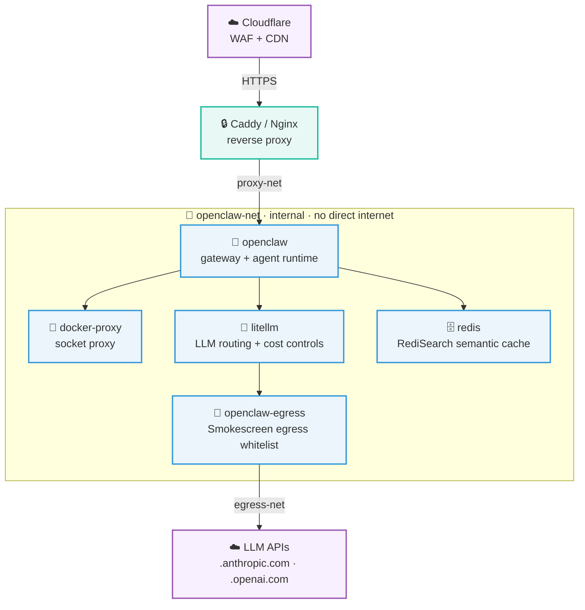

<p align="center">
  <h1 align="center">🦞 clincher</h1>
  <p align="center"><strong>One curl. Hardened AI agent. Done.</strong></p>
  <p align="center">
    <a href="https://github.com/droxey/clincher/actions/workflows/ci.yml"></a>
    <a href="https://docs.ansible.com/"></a>
    <a href="https://github.com/openclaw/openclaw"></a>
    <a href="https://www.docker.com/"></a>
    <a href="https://releases.ubuntu.com/24.04/"></a>
    <a href="LICENSE"></a>
  </p>
  <p align="center">
    <a href="https://github.com/droxey/clincher/stargazers"></a>
  </p>
  <p align="center">
    <a href="#why-clincher">Why</a> •
    <a href="#quick-start">Quick Start</a> •
    <a href="docs/architecture.md">Architecture</a> •
    <a href="docs/deployment-guide.md">Deployment Guide</a> •
    <a href="docs/security-model.md">Security</a> •
    <a href="docs/troubleshooting.md">Troubleshooting</a>
  </p>
</p>

---

## Why clincher?

Setting up a production AI agent on a VPS is a slog. Firewall rules, egress proxies, socket isolation, sandbox hardening, credential rotation. Miss one and your agent has root-equivalent access to the internet. Nobody wants that.

clincher handles all of it with one Ansible playbook:

- `openclaw-net` runs `internal: true`. Your agent can't reach the internet directly.
- Smokescreen proxies egress traffic. Only LLM API domains get through.
- One `curl` pipes to `bash` on a fresh Ubuntu 24.04 box and you're done.
- The whole thing is idempotent. Run it again, nothing breaks.
- 9 hardening layers. SSH, containers, sandbox, firewall, the works.

---

## Quick Start

SSH into a fresh Ubuntu 24.04 VPS as root:

```bash
curl -fsSL https://raw.githubusercontent.com/droxey/clincher/main/bootstrap.sh | bash
```

That installs Ansible, clones the repo, asks for your API keys and domain, generates secrets, encrypts the vault, and runs the playbook. Have your Anthropic key, Voyage key, and domain name handy.

> **Prefer to read before you run?**
>
> ```bash
> curl -fsSL https://raw.githubusercontent.com/droxey/clincher/main/bootstrap.sh -o bootstrap.sh
> less bootstrap.sh
> bash bootstrap.sh
> ```

<details>
<summary><strong>Manual setup (separate control machine)</strong></summary>

```bash
# 1. Clone and configure
git clone https://github.com/droxey/clincher.git && cd clincher
cp group_vars/all/vault.yml.example group_vars/all/vault.yml
$EDITOR group_vars/all/vault.yml          # API keys, Telegram token, 3 internal secrets
ansible-vault encrypt group_vars/all/vault.yml

# 2. Point at your server
$EDITOR inventory/hosts.yml              # set ansible_host to your VPS IP

# 3. Deploy
ansible-playbook playbook.yml -i inventory/hosts.yml --ask-vault-pass
```

</details>

> Working on clincher itself? `make help` lists targets. `make check` runs the full CI suite locally.

---

## Architecture



| Service | What it does |
|---------|-------------|
| openclaw | Agent runtime and gateway |
| litellm | Routes LLM calls, tracks costs |
| openclaw-egress | Smokescreen egress proxy, whitelist-only |
| redis | Semantic cache via RediSearch |
| docker-proxy | Exposes a locked-down slice of the Docker API |

Three bridge networks keep things separated. `openclaw-net` is internal, no internet. `egress-net` lets the proxy reach LLM APIs and nothing else. `proxy-net` connects the reverse proxy to the gateway.

[Full architecture docs](docs/architecture.md) cover images, version pins, and the monitoring topology on the second VPS.

---

## Security

Nine hardening layers: network isolation, egress control, socket proxy, container caps, sandbox isolation, tool denials, file-based secrets, SSH lockdown, UFW + fail2ban.

```bash
# Run the built-in security audit
docker exec $(docker ps -q -f "name=openclaw") openclaw security audit --deep

# Check sandbox status
docker exec $(docker ps -q -f "name=openclaw") openclaw sandbox explain
```

[Full security model](docs/security-model.md) has the threat model, layer-by-layer breakdown, and verification commands.

---

## Docs

| | |
|---|---|
| [Deployment Guide](docs/deployment-guide.md) | 14 steps, prerequisites through scaling |
| [Architecture](docs/architecture.md) | Topology, services, networks, monitoring |
| [Security Model](docs/security-model.md) | Threat model, 9 hardening layers |
| [Troubleshooting](docs/troubleshooting.md) | Symptom → diagnostic → fix |
| [Use Cases](USECASES.md) | How people are actually using this |
| [Links](LINKS.md) | Resources and references |

---

## Contributing

[CONTRIBUTING.md](CONTRIBUTING.md) has the details. Short version: add a role, improve a prompt, or report a security issue.

---

## License

[MIT](LICENSE)
