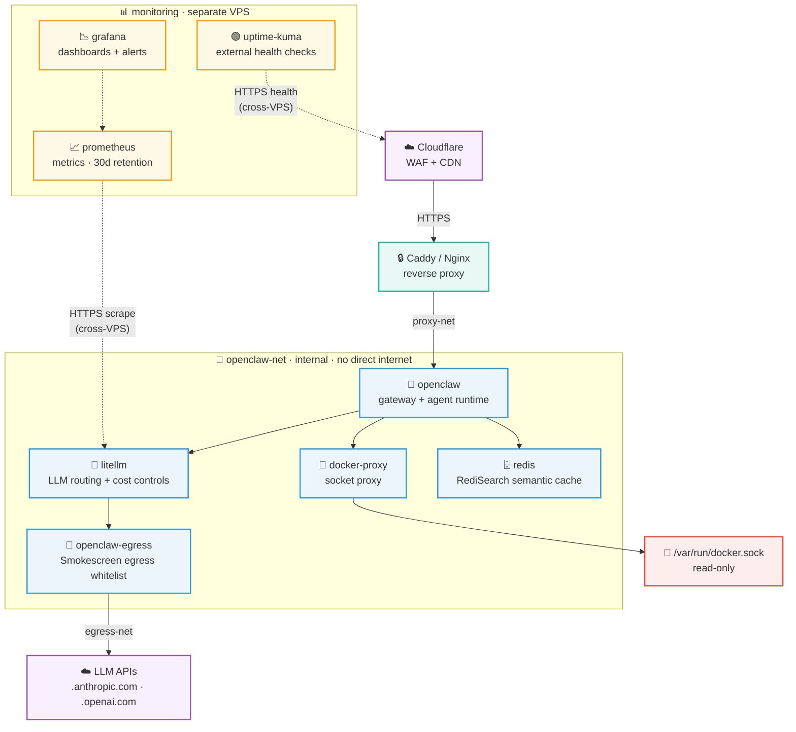

# Architecture

> Deployment topology, services, and network isolation for clincher.

---

## Deployment Topology

Three bridge networks enforce least-privilege communication. `openclaw-net` is **internal** — no internet access. The egress proxy bridges internal and external via `egress-net`. The reverse proxy reaches the gateway via `proxy-net`. Dashed lines indicate monitoring connections that cross VPS boundaries. Traffic between co-located services never leaves the host, so no IPSEC encryption is needed.

## Services

| Service | Image | Purpose | Network |
|---------|-------|---------|---------|
| `docker-proxy` | `ghcr.io/tecnativa/docker-socket-proxy:v0.4.2` | Sandboxed Docker API (EXEC only) | `openclaw-net` |
| `openclaw` | `ghcr.io/openclaw/openclaw:2026.3.13` | Main gateway — agent runtime, tool execution | `openclaw-net` + `proxy-net` |
| `litellm` | `ghcr.io/berriai/litellm:main-v1.81.3-stable` | LLM API proxy — routing, cost controls, caching | `openclaw-net` |
| `openclaw-egress` | Built from [stripe/smokescreen](https://github.com/stripe/smokescreen) | Egress whitelist proxy for LLM API calls | `openclaw-net` + `egress-net` |
| `redis` | `redis/redis-stack-server:7.4.0-v3` | Semantic cache (RediSearch module) | `openclaw-net` |

## Networks

Three bridge networks enforce least-privilege communication between services:

- **`openclaw-net`**: Internal bridge — no internet access. Core services live here. Configured with `internal: true` to prevent any direct internet connectivity.
- **`egress-net`**: Bridges the egress proxy to the internet for whitelisted LLM API calls only. Only the Smokescreen proxy and external LLM endpoints communicate over this network.
- **`proxy-net`**: Connects the reverse proxy (Caddy/Nginx) to the OpenClaw gateway. This is the only path for inbound HTTPS traffic to reach the application.

## Monitoring

Monitoring services (Prometheus, Grafana, Uptime Kuma) run on a **separate VPS** and are deployed via `ansible-playbook caprover-playbook.yml`. They scrape the OpenClaw host remotely over HTTPS, keeping monitoring infrastructure isolated from the production workload. This separation ensures that a compromise of the monitoring stack does not grant access to the application network, and vice versa.
